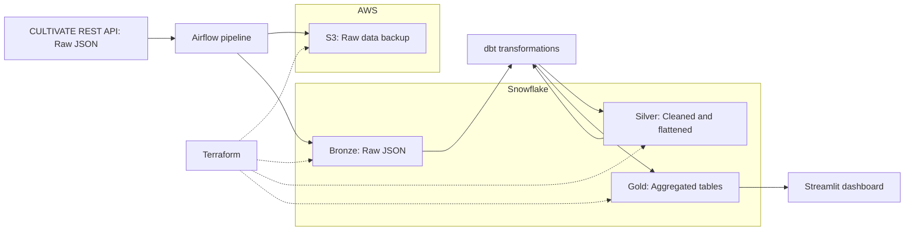

# Food Sharing Map — Data Pipeline & Dashboard

## Problem description

Food sharing initiatives are growing worldwide, yet there is no centralised, easy-to-explore analytical view of this movement. The [Food Sharing Map (CULTIVATE project)](https://www.sharingsolutions.eu/food-sharing-map) provides a public REST API with data on 3,000+ food sharing organisations across more than 100 countries. With its scalable automated mapping tool, the project plans to expand to an additional 100 cities by 2026.

However, the data is currently available only as raw JSON, which is not suitable for analysis or decision-making.

This project builds an **end-to-end data pipeline** that:
1. Ingests data from the CULTIVATE REST API  
2. Loads it into a Snowflake data warehouse  
3. Transforms it using a medallion architecture (bronze → silver → gold)  
4. Serves it through an interactive Streamlit dashboard  

The goal is to make food sharing data accessible to researchers, policymakers, and the CULTIVATE team.

---

## Architecture



**Infrastructure is managed with Terraform** (AWS S3, Snowflake databases/schemas/warehouses).

---

## Technology Stack

| Component | Technology | Why |
|-----------|-----------|-----|
| Orchestration | **Apache Airflow** | Industry-standard for batch pipelines; DAG-based scheduling; built-in REST API for manual triggers |
| Data Warehouse | **Snowflake** | Scalable cloud DWH; native VARIANT type for JSON; LATERAL FLATTEN for array processing; auto-suspend warehouses for cost control |
| Transformation | **dbt** | SQL-based transformations; medallion architecture support; built-in testing and documentation |
| IaC | **Terraform** | Declarative infrastructure; supports both AWS and Snowflake providers; version-controlled state |
| Dashboard | **Streamlit** | Python-native; rapid prototyping; free Community Cloud hosting for public access |
| Cloud | **AWS** | S3 for raw data archival; IAM for access control |

---

## Data Model

Uses dbt's **staging → intermediate → marts** convention, mapped to Snowflake's medallion schemas:

### Staging → BRONZE (views)
- `stg_initiatives` — Extracts fields from raw JSON, casts types, filters to latest snapshot.

### Intermediate → SILVER (tables)
- `int_initiatives_activities` — Flattened `foodSharingActivities` array → one row per initiative per activity type.
- `int_initiatives_sharing_methods` — Flattened `howItIsShared` array → one row per initiative per sharing method.

### Marts → GOLD (tables)
- `fct_activity_distribution` — Activity type counts, percentages, geographic spread.
- `fct_geo_distribution` — Country/city level initiative counts with coordinates.
- `fct_country_summary` — Country-level aggregates with centroids for map visualization.

### Source (Airflow-managed)
- `BRONZE.RAW_INITIATIVES` — Raw JSON records as Snowflake VARIANT, appended with `ingested_at` timestamp for history.

---

## Snowflake Optimization

### Clustering Keys
- **`fct_geo_distribution`**: clustered by `country` — most dashboard queries filter or group by country.
- **`fct_country_summary`**: clustered by `country` — supports fast lookups for country drill-downs.
- **`fct_activity_distribution`**: clustered by `activity_type` — optimizes the primary activity breakdown query.

### Why these keys?
The dashboard's two primary tiles query by activity type and by country. Clustering on these columns ensures that Snowflake's micro-partitions are pruned efficiently, minimizing scan volume. Given the current dataset size (~500 records), the clustering benefit is marginal — but as the CULTIVATE project grows (new countries, more initiatives), these keys will prevent query degradation without requiring schema changes.

### Additional optimizations
- **Auto-suspend**: Both warehouses auto-suspend after 60 seconds of inactivity to minimize credit consumption.
- **Separate warehouses**: ETL and dashboard queries use separate X-SMALL warehouses to prevent contention.

---

## Dashboard Tiles

### Tile 1: Food Sharing Activities by Type
Categorical bar chart and pie chart showing how many initiatives engage in each activity type (Distribution, Growing, Cooking & Eating, Collecting, etc.).

### Tile 2: Geographic Distribution
- Top-N countries bar chart (adjustable slider)
- Interactive world map with initiative locations (scatter mapbox)
- Country drill-down with per-city breakdown and activity composition

### Bonus: Sharing Methods
How food is shared across initiatives (Gifting, Selling, Bartering, Collecting).

### Manual Pipeline Trigger
Button that calls the Airflow REST API (`POST /api/v1/dags/food_sharing_map_pipeline/dagRuns`) to trigger a manual data refresh.

---

## Scheduling

The pipeline runs on a **semi-annual schedule** (January 1 and July 1) via Airflow cron: `0 0 1 1,7 *`.

This matches the data update cadence of the CULTIVATE API — the underlying research data is updated infrequently. The Airflow REST API endpoint is exposed for ad-hoc manual triggers.

---

## Tests

### Airflow DAG tests

```bash
cd airflow
python -m pytest tests/ -v
```

| Test | What it checks |
|---|---|
| `test_file_imports` | DAG files load without import errors |
| `test_dag_has_tags` | Every DAG has at least one tag |
| `test_dag_has_description` | Every DAG has a description |
| `test_dag_has_retries` | Every task has retries configured |
| `test_extract_*` | API response parsing (dict wrapper, plain list, error handling) |
| `test_row_*` | Snowflake row preparation (with/without id, multiple rows) |

### dbt tests

```bash
cd dbt
dbt test
```

| Model | Tests |
|---|---|
| `stg_initiatives` | `initiative_id` unique + not_null, `initiative_name` not_null |
| `int_initiatives_activities` | `initiative_id` not_null, `activity_type` not_null |
| `int_initiatives_sharing_methods` | `initiative_id` not_null, `sharing_method` not_null |
| `fct_activity_distribution` | `activity_type` unique + not_null |
| `fct_geo_distribution` | `country` not_null |
| `fct_country_summary` | `country` unique + not_null |

### Terraform validation

```bash
cd terraform
terraform validate
terraform plan
```

---

## How to Reproduce

### Prerequisites
- AWS account with S3 access
- Snowflake account (trial is fine)
- Python 3.10+
- Terraform 1.5+
- Docker (for Airflow)

### Step 1: Clone the repo
```bash
git clone https://github.com/<your-username>/food-sharing-map.git
cd food-sharing-map
```

### Step 2: Provision infrastructure with Terraform
```bash
cd terraform
cp terraform.tfvars.example terraform.tfvars
# Edit terraform.tfvars with your Snowflake and AWS credentials
terraform init
terraform plan
terraform apply
cd ..
```

### Step 3: Configure Airflow
```bash
# Using Docker Compose (recommended)
cd airflow
docker compose up -d

# Set up Snowflake connection in Airflow UI:
# Admin → Connections → Add
#   Conn ID: snowflake_default
#   Conn Type: Snowflake
#   Login: <your_user>
#   Password: <your_password>
#   Extra: {"account": "<your_account>", "warehouse": "FOOD_SHARING_ETL_WH", "database": "FOOD_SHARING_MAP", "role": "FOOD_SHARING_ETL_ROLE"}
```

### Step 4: Configure and run dbt
```bash
cd dbt
# Set environment variables
export SNOWFLAKE_ACCOUNT=<your_account>
export SNOWFLAKE_USER=<your_user>
export SNOWFLAKE_PASSWORD=<your_password>

dbt deps
dbt run
dbt test
cd ..
```

### Step 5: Run the dashboard
```bash
cd dashboard
pip install -r requirements.txt
streamlit run app.py
```

The dashboard works in **two modes**:
- **With Snowflake**: Create `dashboard/.streamlit/secrets.toml` with your Snowflake credentials
- **Without Snowflake** (demo): Falls back to fetching directly from the REST API

### Step 6: Deploy dashboard (for public access)
```bash
# Using Streamlit Community Cloud:
# 1. Push repo to GitHub
# 2. Go to share.streamlit.io
# 3. Deploy from your repo → dashboard/app.py
# 4. Add Snowflake secrets in the Streamlit Cloud settings
```

---

## Dashboard Access

> **Live dashboard**: https://foodsharingmapdashboard.streamlit.app/
>
> To run locally: `cd dashboard && streamlit run app.py`

---

## Project Structure

```
food-sharing-map/
├── airflow/
│   ├── dags/
│   │   └── food_sharing_map_dag.py    # Pipeline DAG: API → S3 → Snowflake → dbt
│   ├── tests/                         # DAG validation + unit tests
│   ├── Dockerfile                     # Airflow 2.8.1 + Python 3.11
│   └── docker-compose.yaml            # Local Airflow setup
├── terraform/
│   ├── main.tf                        # AWS: S3, IAM, EC2, Lambda, EventBridge
│   ├── snowflake.tf                   # Snowflake: DB, schemas, warehouses, roles
│   ├── variables.tf                   # Input variables
│   ├── providers.tf                   # AWS + Snowflake providers
│   ├── outputs.tf                     # Resource outputs
│   └── lambda/                        # Lambda function for EC2 start
├── dbt/
│   ├── dbt_project.yml                # dbt configuration
│   ├── profiles.yml                   # Connection profiles
│   ├── macros/                        # Custom schema macro
│   └── models/
│       ├── staging/                   # Source data extraction (→ BRONZE)
│       │   └── stg_initiatives.sql
│       ├── intermediate/              # Flatten & transform (→ SILVER)
│       │   ├── int_initiatives_activities.sql
│       │   └── int_initiatives_sharing_methods.sql
│       └── marts/                     # Aggregated for dashboard (→ GOLD)
│           ├── fct_activity_distribution.sql
│           ├── fct_geo_distribution.sql
│           └── fct_country_summary.sql
├── .github/
│   └── workflows/
│       └── terraform.yml              # CI/CD for Terraform
├── dashboard/
│   ├── app.py                         # Streamlit dashboard
│   └── requirements.txt
├── requirements.txt                   # Root dependencies
├── CLAUDE.md                          # Project instructions
├── .gitignore
└── README.md
```

---

## Data Source

- **API**: `https://www.sharingsolutions.eu/wp-json/cultivate/v1/data`
- **Authentication**: None required
- **Format**: JSON array of objects
- **Records**: ~500+ food sharing initiatives
- **Fields**: `id`, `name`, `url`, `facebookUrl`, `xUrl`, `instagramUrl`, `foodSharingActivities` (array), `howItIsShared` (array), `country`, `city`, `lng`, `lat`

---

## License

This project uses publicly available data from the CULTIVATE project. The pipeline code is open source.
